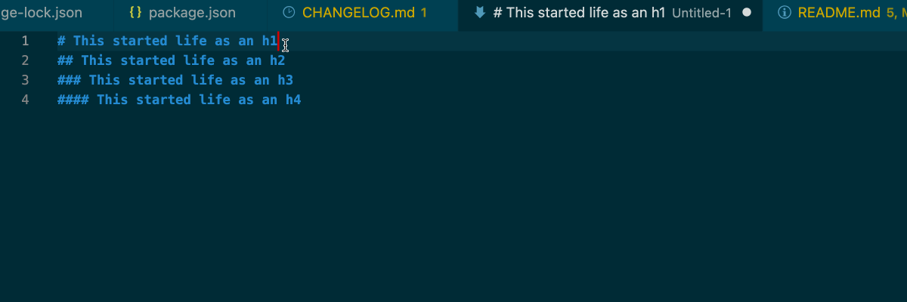

# VSCode extension Increase Header Level for Markdown

This VSCode extension is developed to increase the levels of all headers in the selected part of a Markdown file.

It's based on [Lower Header Level for Markdown](https://github.com/ruichima/lower-header-level-for-markdown) by [Ruichima](https://github.com/ruichima/).

## Features

- increase the levels of all headers in the selected part of a Markdown file.
<!-- - increase the levels of all headers in the selected part of a Markdown file. See an example below. -->

## Install

- This VSCode extension is available in the VSCode Extension Marketplace now. Search `increase header level for Markdown` in it and install or click [here](https://marketplace.visualstudio.com/items?itemName=DiscoveryWorks.increase-header-level-for-markdown) to visit the installation page directly.

## Run

- Select the text including the headers of which levels you want to increase.
- Type `CTRL+SHIFT+P` to open the command board and input `increase header level for Markdown`. A shortcut `CTRL+SHIFT+4` is also provided.

## Resource code

https://github.com/jonathanpberger/increase-header-level-for-markdown

## Release Notes

### 1.0.1

Documentation update.
### 1.0.0

Initial release.

## License

[MIT](./LICENSE)
